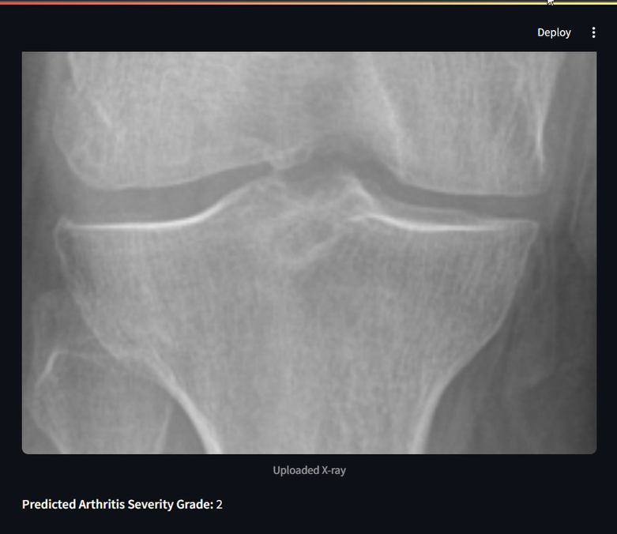

# 🦴 Osteoarthritis Severity Prediction Using Transfer Learning

This project applies **Transfer Learning** with **EfficientNet** using **TensorFlow** to predict the severity of Osteoarthritis based on image data.

## 📌 Overview

- Developed a deep learning model to classify osteoarthritis severity levels.
- Utilized **EfficientNet** (pretrained on ImageNet) for transfer learning.
- Created custom CNN layers for identifying the sevirity of osteoarthritis
- Achieved **60% accuracy** on training data.
- Built using `TensorFlow`, `Keras`, `NumPy`, `Matplotlib`, and `Pandas`.
- Data sourced from a **Kaggle dataset on Osteoarthritis knee X-rays**.

## ⚠️ Note on Dataset Imbalance

The dataset used for training is **highly imbalanced**, with the following distribution:

- **Severity 0**: 2286 images  
- **Severity 1**: 1046 images  
- **Severity 2**: 1156 images  
- **Severity 3**: 757 images  
- **Severity 4**: 173 images  

As a result, the model shows a **bias toward predicting Grade 2** severity. We are actively working on improving this through:

- Class-weighted loss functions
- Data augmentation
- Oversampling of minority classes

## 🧠 Technologies Used

- Python 3.10
- TensorFlow 2.x
- EfficientNet
- Pandas & NumPy
- Matplotlib
- Streamlit (for deployment, optional)

## 📊 Model Performance

- **Training Accuracy**: 60%
- Model is in early development, with plans to improve generalization and reduce overfitting.

## 📁 Folder Structure

```

📦 Osteoarthritis-ML
┣ 📜 app.py
┣ 📜 model\_training.ipynb
┣ 📜 environment.yml
┣ 📜 Papers 
┣ 📜 README.md
┗ 📷 output.png

```

## 🗂️ Dataset

- Source: [Kaggle Osteoarthritis Dataset](https://www.kaggle.com/datasets/shashwatwork/knee-osteoarthritis-dataset-with-severity)
- Preprocessed and augmented to improve training diversity.

## 🚀 Running the Project

1. Clone the repository:

```bash
git clone https://github.com/yourusername/osteoarthritis-ml-project.git
cd osteoarthritis-ml-project
````

2. Create the environment:

```bash
conda env create -f environment.yml
conda activate ml-project-env
```

3. Run the notebook or `app.py`:

```bash
streamlit run app.py
```

## 👥 Contributors

* [Omkar Tilekar](https://github.com/Rakmo5)
* [Shilpa Patil](https://github.com/ShilpaPatil7777)
<!-- * [Yash Limbhore](https://github.com/friendusername) -->
## 🖼️ Output Preview


## 📄 License


```
MIT License

Copyright (c) 2025 Omkar Tilekar

Permission is hereby granted, free of charge, to any person obtaining a copy
of this software and associated documentation files (the "Software"), to deal
in the Software without restriction, including without limitation the rights
to use, copy, modify, merge, publish, distribute, sublicense, and/or sell
copies of the Software, and to permit persons to whom the Software is
furnished to do so, subject to the following conditions:

The above copyright notice and this permission notice shall be included in all
copies or substantial portions of the Software.

THE SOFTWARE IS PROVIDED "AS IS", WITHOUT WARRANTY OF ANY KIND, EXPRESS OR
IMPLIED, INCLUDING BUT NOT LIMITED TO THE WARRANTIES OF MERCHANTABILITY,
FITNESS FOR A PARTICULAR PURPOSE AND NONINFRINGEMENT. IN NO EVENT SHALL THE
AUTHORS OR COPYRIGHT HOLDERS BE LIABLE FOR ANY CLAIM, DAMAGES OR OTHER
LIABILITY, WHETHER IN AN ACTION OF CONTRACT, TORT OR OTHERWISE, ARISING FROM,
OUT OF OR IN CONNECTION WITH THE SOFTWARE OR THE USE OR OTHER DEALINGS IN THE
SOFTWARE.

---

